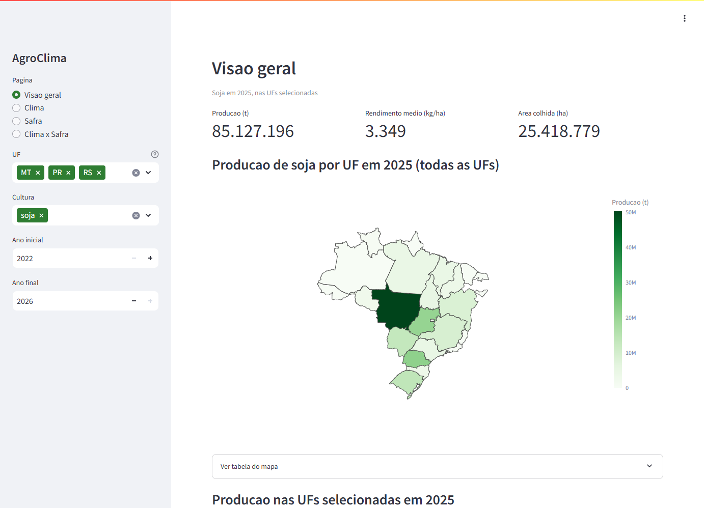
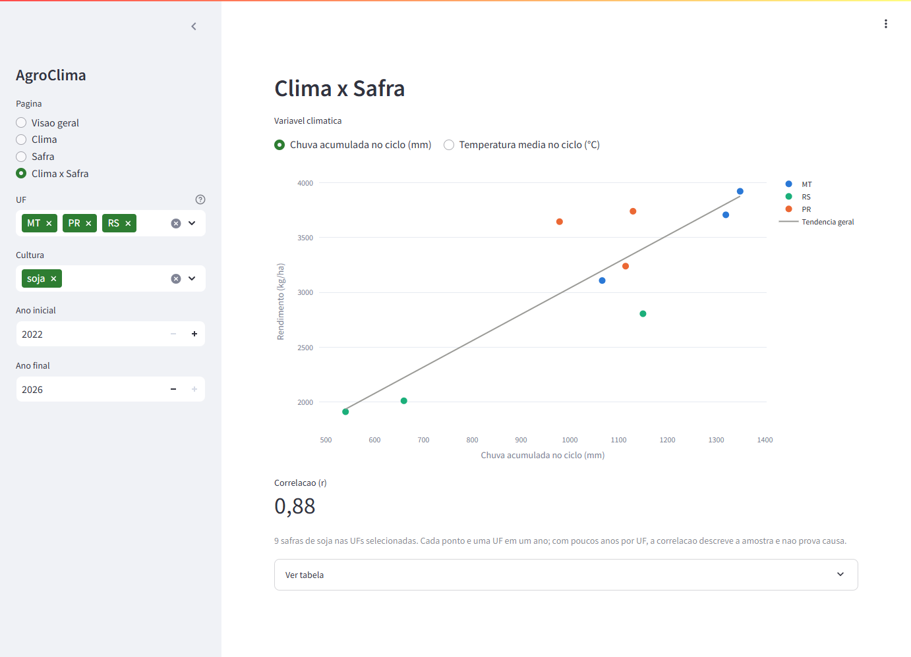

# AgroClima Analytics

Pipeline de dados que cruza clima e producao agricola no Brasil por estado.
Coleta dados do INMET e do IBGE, transforma em camadas Bronze/Silver/Gold e
disponibiliza em um dashboard interativo.

A pergunta que o projeto responde: como chuva e temperatura se relacionam com
a produtividade das principais culturas, por estado?



## O que o projeto faz

1. Baixa o historico horario das estacoes automaticas do INMET (2022-2026)
2. Busca area, producao e rendimento de soja, milho, cafe e cana no IBGE/SIDRA
3. Armazena os dados brutos em Parquet (Bronze)
4. Limpa e agrega o horario para diario por estacao com dbt (Silver)
5. Agrega por estado e mes, calcula medias moveis, anomalias e o clima de cada
   ciclo de safra com dbt (Gold)
6. Exibe os resultados num dashboard Streamlit

O Airflow agenda o processo todo dia as 09h UTC (06h no horario de Brasilia).

## Dashboard

- **Visao geral** - producao, rendimento e area de uma cultura, com mapa do
  Brasil por estado e comparacao entre os estados selecionados
- **Clima** - temperatura, media movel de 3 meses, chuva mensal e anomalia de
  temperatura por estado
- **Safra** - producao, rendimento e variacao anual por estado e cultura
- **Clima x Safra** - chuva ou temperatura acumulada no ciclo da cultura contra
  o rendimento, com a correlacao da amostra



## O que os dados mostram

Com os filtros padrao (soja em MT, PR e RS), a chuva acumulada no ciclo tem
correlacao de 0,88 com o rendimento. O numero e puxado pelo RS: as safras
2022/23 e 2024/25 tiveram 540 e 660 mm no ciclo e os menores rendimentos da
amostra. So com MT e PR a correlacao cai para 0,56; com todos os estados que
plantam soja (70 safras), fica em 0,07.

Ou seja, secas fortes aparecem nos dados, mas a chuva total do ciclo sozinha
nao explica o rendimento no pais. Irrigacao, distribuicao da chuva ao longo
do ciclo e diferencas de manejo entre regioes pesam, e o projeto nao mede
essas variaveis. A cada ano novo de dados a amostra cresce.

## Tecnologias

- Python - ingestao
- dbt + DuckDB - transformacao, modelagem e testes
- Apache Airflow - agendamento
- Streamlit + Plotly - dashboard
- Docker - para rodar tudo junto

## Dados coletados

INMET (dados historicos das estacoes automaticas):

- temperatura, precipitacao, umidade e vento, por hora, agregados por estado

IBGE/SIDRA:

- PAM (tabela 5457): area plantada, area colhida, producao e rendimento anuais
- LSPA (tabela 6588): estimativas mensais da safra, usadas para conferir o
  milho da PAM

IBGE/malhas: contorno dos estados para o mapa, versionado em `dashboard/assets`.

## Como rodar

### Com Docker (inclui Airflow)

```
cp .env.example .env
docker compose up -d
```

- Dashboard: http://localhost:8501
- Airflow: http://localhost:8080 (usuario `admin`, senha definida em
  `AIRFLOW_PASSWORD` no `.env`; o padrao e `admin`)

Na primeira subida a DAG `agroclima_pipeline` ja roda uma vez: baixa cerca de
300 MB do INMET e leva uns 15 minutos. O dashboard mostra dados quando ela
termina. As execucoes seguintes verificam o ETag dos arquivos do INMET e so
baixam o que mudou, entao levam menos de um minuto.

O historico do Airflow fica no volume `airflow_estado` e sobrevive a
`docker compose down`. Para apagar tudo, use `docker compose down -v`.

### Local (sem Docker)

```
python -m venv venv
venv\Scripts\activate
pip install -r requirements.txt
cd dbt && python -m dbt.cli.main deps && cd ..

python -m src.pipeline
python -m streamlit run dashboard/app.py
```

Acesse: http://localhost:8501

Para avaliar o projeto sem esperar o download do INMET, rode
`python scripts/seed_bronze_dev.py` antes: ele grava uma camada Bronze
fabricada e pequena, no mesmo formato da ingestao real, o suficiente para
rodar o dbt (`cd dbt && python -m dbt.cli.main build`) e abrir o dashboard.
O seed so tem DF, SP e MG; selecione esses estados no filtro.

`dbt` e `streamlit` sao chamados como modulo (`python -m ...`) porque, no
Python distribuido pela Microsoft Store, os console scripts desses pacotes
nao ficam expostos no PATH. Se o seu Python nao tiver essa limitacao, os
comandos `dbt` e `streamlit run` diretos tambem funcionam.

O Airflow nao roda nativamente no Windows; use o Docker para a parte de
agendamento.

### Testes

Instale tambem as dependencias de desenvolvimento (`pytest` e `responses`,
que nao entram nas imagens de producao). O `dbt deps` e necessario:
`test_pipeline_smoke.py` roda um `dbt build` de verdade sobre dados
fabricados e depende do pacote `dbt_utils`.

```
pip install -r requirements-dev.txt
cd dbt && python -m dbt.cli.main deps && cd ..
python -m pytest
```

A suite nao acessa a rede: as APIs sao simuladas e o dashboard e testado
contra um DuckDB temporario. Os testes do dbt verificam regras que valem para
qualquer dado (por exemplo, que a chuva de um estado e a media entre as
estacoes, nao a soma) e rodam tanto no seed quanto na base real.

## Makefile

Atalhos para os comandos acima (`dbt` e `streamlit` continuam sendo
chamados como modulo, pelo mesmo motivo citado na secao anterior):

```
make install      # requirements.txt + dbt deps
make install-dev  # + requirements-dev.txt (pytest, responses)
make test         # python -m pytest -v
make pipeline     # python -m src.pipeline
make dbt          # cd dbt && dbt build
make dashboard    # streamlit run dashboard/app.py
make up           # docker compose up -d
make down         # docker compose down
```

## Estrutura

O desenho completo, com as decisoes e o porque de cada uma, esta em
[docs/design.md](docs/design.md).

- `src/ingestion` - clientes das APIs, gravam Parquet em `data/bronze`
- `scripts/seed_bronze_dev.py` - gera uma Bronze fake para desenvolvimento local
- `dbt/models/staging` - limpeza e padronizacao (Silver)
- `dbt/models/marts` - KPIs e cruzamentos (Gold)
- `dbt/tests` - testes singulares do dbt
- `dashboard` - aplicacao Streamlit
- `airflow/dags` - agendamento
- `airflow/iniciar.sh` - partida do container do Airflow (usuario e dependencias do dbt)
- `requirements.txt` - dependencias para rodar local e o dashboard
- `requirements-dev.txt` - `requirements.txt` mais `pytest` e `responses`,
  usadas so pela suite de testes
- `requirements-airflow.txt` - subconjunto usado na imagem do Airflow (sem
  streamlit/plotly/statsmodels, que sao so do dashboard e podem colidir com
  as constraints do apache/airflow)

## Limitacoes conhecidas

- A media climatica por estado nao e ponderada por area: estados grandes tem
  cobertura desigual de estacoes. O campo `n_estacoes` fica visivel no
  dashboard para o leitor julgar cada ponto.
- A API horaria do INMET (`apitempo`) esta fechada e retorna 204; o projeto
  usa os arquivos anuais de dados historicos, atualizados a cada ~90 dias.
- A anomalia climatica nao e calculada contra uma normal de 30 anos.
  `gold_clima_uf_mensal` tira a media de referencia da propria janela de
  2022-2026 que ele agrega, entao `anomalia_temp` e `anomalia_precip` sao o
  desvio em relacao a media de cinco anos daquele mes, nao a uma normal
  climatologica de longo prazo. E a unica referencia possivel com os dados
  que o projeto carrega.
- Safras com ciclo incompleto na base climatica nao aparecem em
  `gold_clima_safra`. O modelo so publica uma linha quando
  `meses_observados = meses_esperados`; um ano-safra cujo ciclo cai na
  borda da janela de clima disponivel ficaria com `precip_ciclo` calculado
  sobre uma fracao do periodo, mas apresentado como se fosse o total. Nao
  publicar a linha e preferivel a publicar um numero errado - por isso a
  pagina de Clima x Safra pode nao cobrir todos os anos que a pagina de
  Safra cobre. A safra de soja 2021/22, por exemplo, fica de fora porque o
  clima comeca em janeiro de 2022.
- Com cinco anos de clima, cada estado tem poucas safras completas, e a
  correlacao da pagina Clima x Safra descreve a amostra selecionada, nao uma
  relacao de causa.

## Fontes

- [INMET Dados Historicos](https://portal.inmet.gov.br/dadoshistoricos)
- [IBGE API de agregados](https://servicodados.ibge.gov.br/api/docs/agregados?versao=3)
- [IBGE API de malhas](https://servicodados.ibge.gov.br/api/docs/malhas?versao=3)
